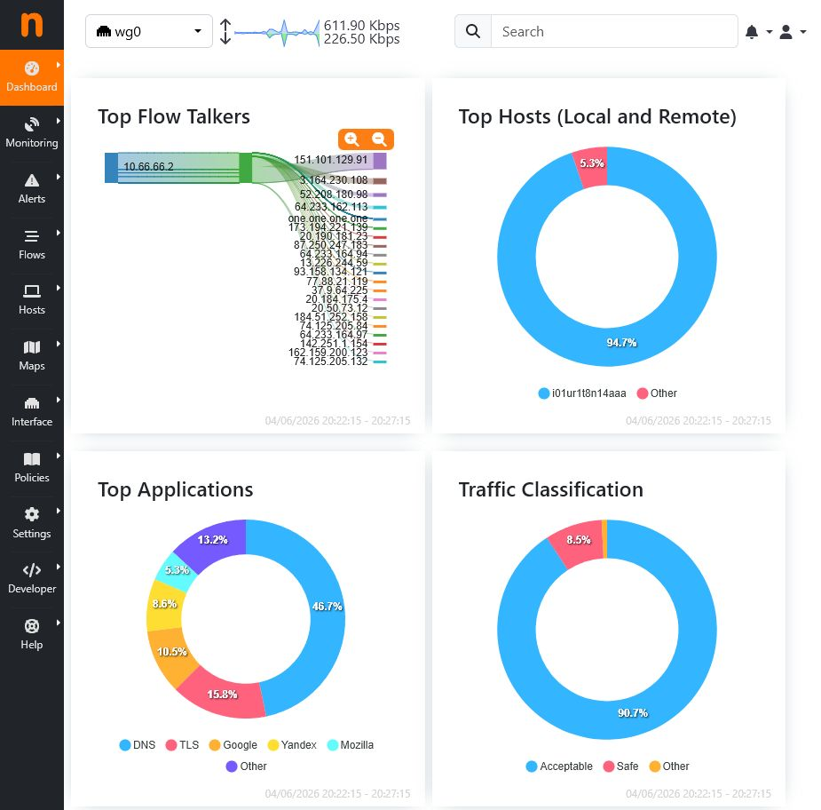
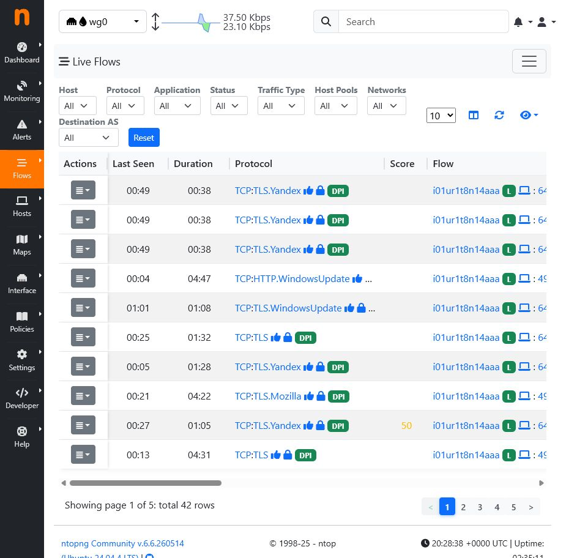
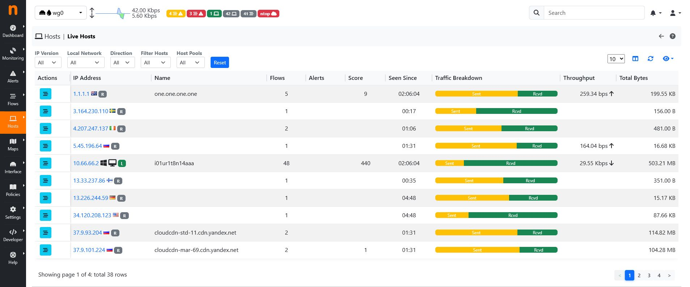
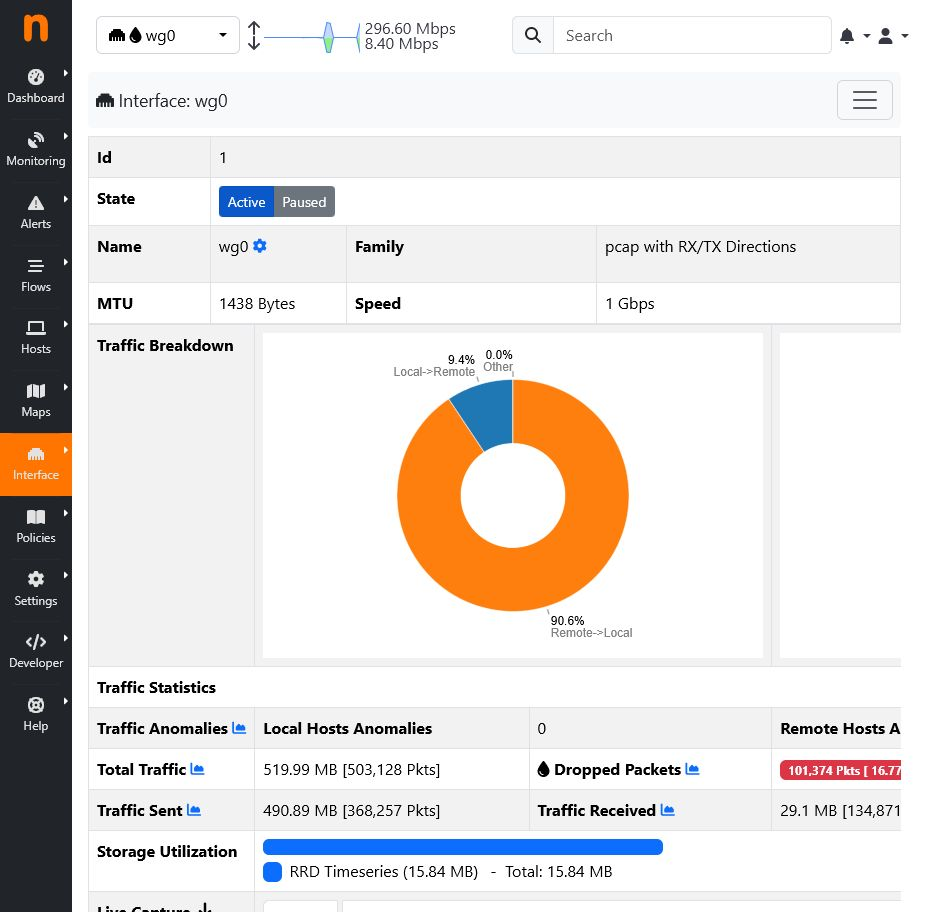
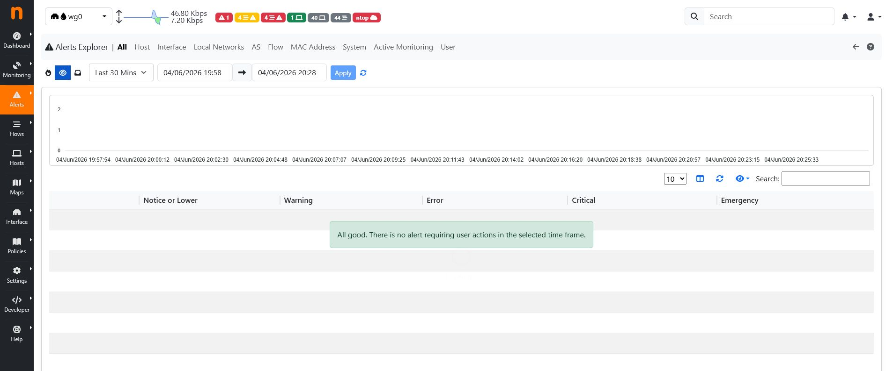
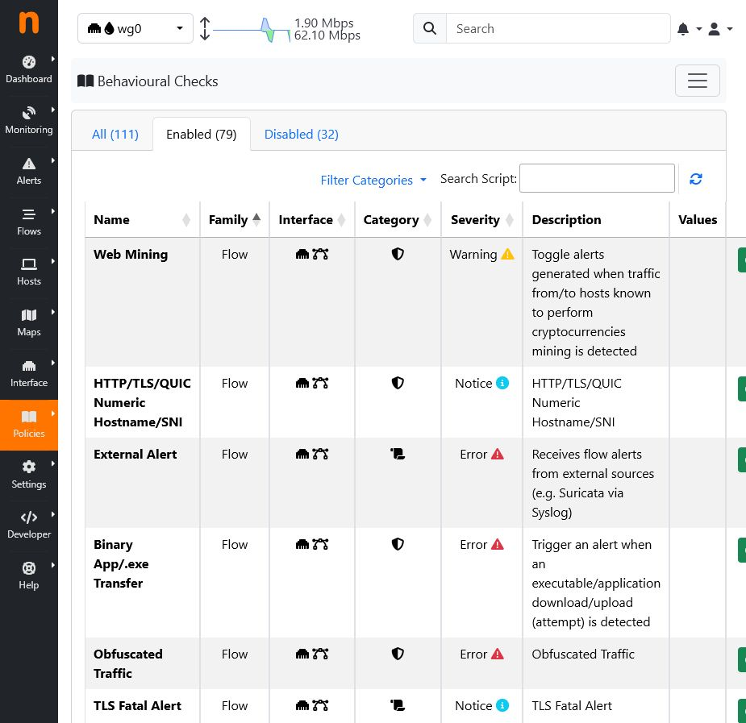
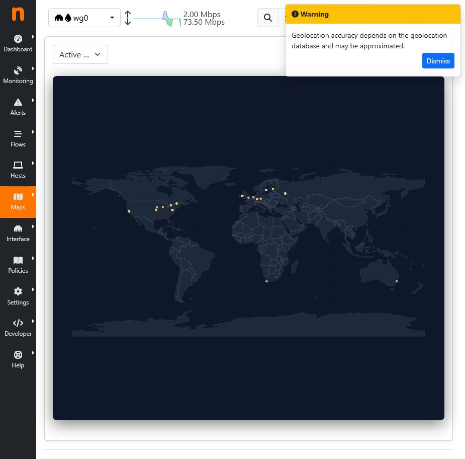

## 1. Стенд глубокого мониторинга сетевого трафика

- Титульный слайд проекта и состава команды.

## 2. Актуальность

- Логи конечных узлов не дают полной картины сетевого обмена.

- Для расследования нужны flows, DNS/TLS-метаданные, приложения и объемы трафика.

- Учебный стенд должен разворачиваться воспроизводимо и показывать результат в реальном времени.

- Отдельный VPS/WireGuard-режим позволяет демонстрировать проект без SPAN/TAP.

## 3. Цель и задачи

- Развернуть ntopng и Redis в Docker.

- Настроить захват пакетов с интерфейса Linux-хоста или `wg0`.

- Показать DPI-классификацию на базе nDPI.

- Настроить алерты и лабораторные scapy-тесты.

- Сохранить сетевую статистику и Zeek-логи для анализа.

## 4. Архитектура

```text
network interface / mirror port / wg0
        |
        +--> ntopng --> nDPI --> flows, hosts, alerts
        |       +--> Redis / ntopng-data
        |
        +--> Zeek --> conn, dns, ssl, http logs

browser --> Nginx Basic Auth --> ntopng UI
```

## 5. Состав стенда

- ntopng: flows, applications, hosts, bandwidth, GeoIP, alerts.

- Zeek: структурированные JSON-логи `conn`, `dns`, `ssl`, `http`.

- Nginx: закрытый вход через Basic Auth и единая точка доступа.

- WireGuard: full tunnel для демонстрации без модернизации сети.

- Scapy: проверочные SYN/DNS/ICMP-сценарии.

## 6. Установка одной командой

- Основной и VPS installer запускаются одной командой.

- Скрипт проверяет Ubuntu, ставит Docker и зависимости.

- Создает `.env`, Basic Auth, UFW rules, systemd/WireGuard.

- Печатает URL панели и путь к клиентскому WireGuard config.

## 7. Главная панель ntopng



- Dashboard показывает интерфейс, top talkers и общую активность.

## 8. Live Flows



- Live Flows отображает текущие соединения, порты, протоколы и объемы.

## 9. Hosts и GeoIP



- Hosts помогает быстро найти активные источники и внешние направления.

## 10. Интерфейс захвата



- Интерфейс `wg0` или физический интерфейс показывает загрузку полосы.

## 11. Alerts



- Раздел Alerts используется для фиксации подозрительных событий.

## 12. Behavioural Checks



- Behavioural Checks задают политики обнаружения отклонений.

## 13. Geomap



- GeoIP-карта визуализирует внешние IP-адреса при наличии баз GeoLite2.

## 14. Результаты и соответствие

- Выполнены требования проекта 25: Docker, ntopng/Redis, DPI, Packet Capture, alerts, flows, Zeek logs.

- Добавлены GeoLite2, Basic Auth reverse-proxy и scapy-тесты.

- Добавлен режим WireGuard VPS demo для практической демонстрации.

- Репозиторий содержит README, LICENSE, `.env.example`, CI, docs, tests и thesis materials.

## 15. Потенциал развития

- Suricata IDS и EVE JSON для сигнатурных срабатываний.

- ClickHouse/OpenSearch/Loki для долгосрочного хранения и поиска.

- Webhook/syslog-интеграция с SIEM и дежурными уведомлениями.

- Prometheus/Grafana для метрик контейнеров и доступности.

- Мультиклиентский WireGuard demo для учебной группы.
